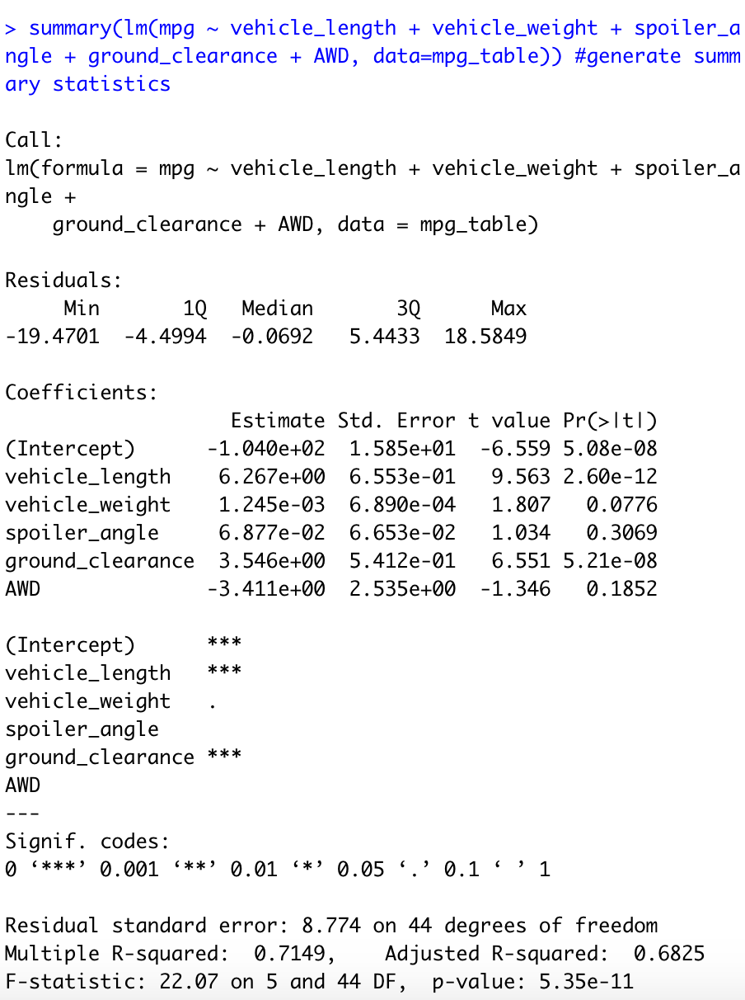
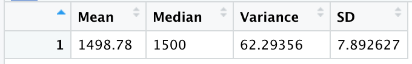
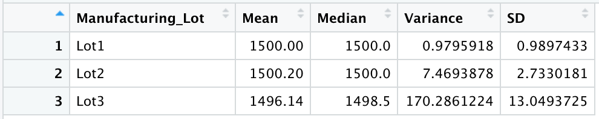
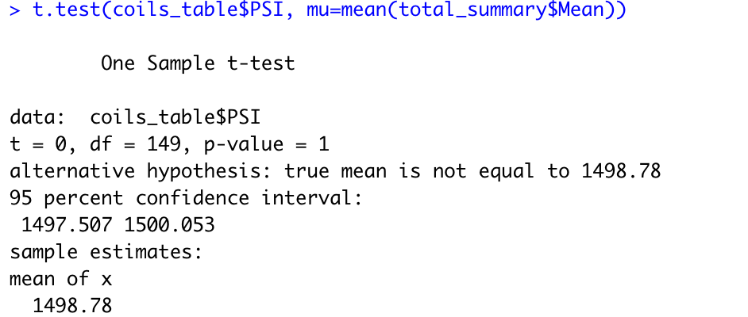
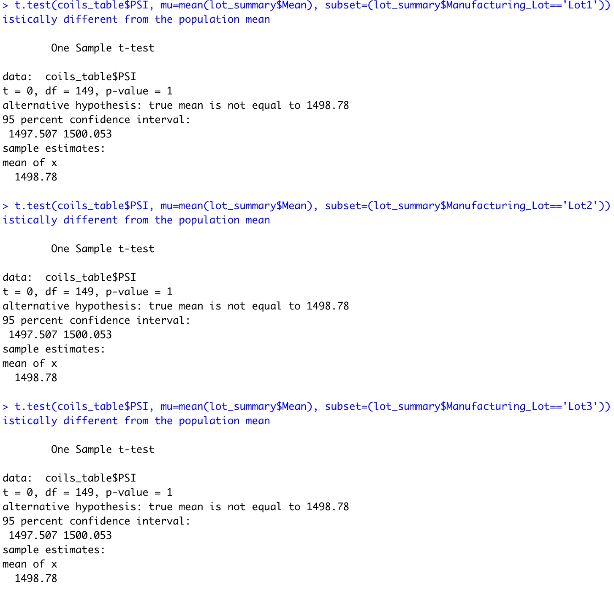

# MechaCar_Statistical_Analysis

## Linear Regression to Predict MPG

*Which variables/coefficients provided a non-random amount of variance to the mpg values in the dataset?*

In our summary seen below, three variables provided a non-random amount of variance to the MPG values: vehicle length, vehicle weight, and ground clearance. Both vehicle length and ground clearance have a near-zero p-value, meaning they each have a statistically significant impact on MPG. Vehicle weight has a p-value pf .05, equal to our assumed significance level.

*Is the slope of the linear model considered to be zero? Why or why not?*

Linear regression testing tests the null hypothesis that the slope of the linear model is equal to zero. When a p-value is lower than the level of significance, we are provided with enough evidence to reject this null hypothesis. Because three of our five coefficient values are less than or equal to .05, the slope cannot be equal to zero. 

*Does this linear model predict mpg of MechaCar prototypes effectively? Why or why not?*

At first glance, we are provided with some exceptional data that can provide insight to influences on miles per gallon. However, there are other factors that influence MPG that are not provided in this dataset. We are missing factors such as highway versus city driving, and fuel type. Are these vehicles running of fossil fuels? Are the electric or possibly hybrid vehicles?  This is a great start, but this model does not provide enough data to effectively and thoroughly predict the MPG of MechaCar prototypes.

## Summary Statistics on Suspension Coils
*The design specifications for the MechaCar suspension coils dictate that the variance of the suspension coils must not exceed 100 pounds per square inch. Does the current manufacturing data meet this design specification for all manufacturing lots in total and each lot individually? Why or why not?*

Across all lots combined, variance of the suspension coils is 62.29 which meets the MechaCar design specifications. However, when we drill down to analyze each lot individually, manufacturing Lot 3 exceeds this variance limitation with a variance of 170.29.

## T-Tests on Suspension Coils
When performing a t-test to conclude whether the PSI across all manufacturing lots differs statistically from the overall population mean, our calculations yielded a p-value of 1.00. Assuming a level of significance of .05, we conclude that the sample and population means are statistically similar.

We achieved similar results testing when performing t-tests for each individual lot against the population mean. For each lot, our calculations provided a p-value of 1.00, and with a level of significance of .05, we have concluded that the sample means from each lot are statically similar to the population mean.

